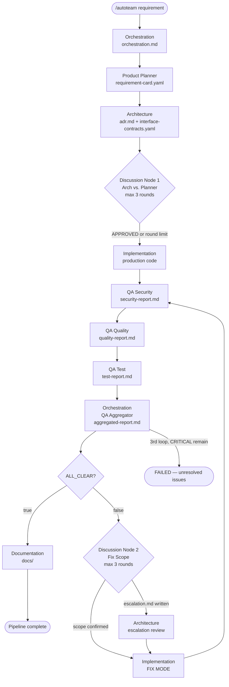

# AutoTeam Design Specification

**Date:** 2026-03-22
**Status:** Active
**Audience:** Future maintainers and contributors

---

## 1. Context

AutoTeam is an autonomous AI development team framework that runs entirely inside Claude Code. A single slash command (`/autoteam "requirement"`) drives a pipeline of specialized subagents from raw requirement through working code, QA, and documentation — without human intervention between steps.

**Problem it solves:** Multi-step software development tasks normally require a human to coordinate analysis, design, implementation, and review. AutoTeam replaces that coordination loop with an agent pipeline where each role produces structured file artifacts consumed by the next.

---

## 2. Architecture Overview

The pipeline is linear with two parallel-capable zones (Implementation module dispatch and QA agent dispatch) and two discussion nodes where agents may negotiate before the pipeline advances.

**Note:** QA agents run in sequence (Security → Quality → Test), not in parallel. Implementation modules without `depends_on` entries may be dispatched in parallel within Step 6.

---

## 3. Agent Roles

| Agent | Model | Responsibility | Input | Output |
|---|---|---|---|---|
| Orchestration | claude-opus-4-6 | Pipeline controller, discussion mediator, QA aggregator, quality gate arbiter | Raw requirement string | Status messages, `discussion/`, `aggregated-report.md`, `fix-instructions.md` |
| Product Planner | claude-sonnet-4-6 | Translates requirement into structured acceptance criteria | Raw requirement | `requirement-card.yaml` |
| Architecture | claude-opus-4-6 | Technology design and interface contracts | `requirement-card.yaml` | `adr.md`, `interface-contracts.yaml` |
| Implementation | claude-sonnet-4-6 | Writes production code; fixes QA findings in FIX MODE | `adr.md`, `interface-contracts.yaml`, `fix-instructions.md` | Source files, optionally `escalation.md` |
| QA Security | claude-sonnet-4-6 | OWASP Top 10, injection, auth vulnerabilities | Source files | `qa-reports/security-report.md` |
| QA Quality | claude-sonnet-4-6 | Complexity, duplication, SOLID violations | Source files | `qa-reports/quality-report.md` |
| QA Test | claude-sonnet-4-6 | Test coverage against acceptance criteria | Source files, `requirement-card.yaml` | `qa-reports/test-report.md` |
| Documentation | claude-haiku-4-5 | README and API documentation | Source files, `adr.md` | `docs/README.md`, `docs/ARCHITECTURE.md`, `docs/API.md` |

---

## 4. Workspace Protocol

All inter-agent communication is mediated through files in `.openclaw/workspace/`. No agent may write to a file it does not own. Agents may read any file freely.

**File ownership map:**

| File | Owner |
|---|---|
| `requirement-card.yaml` | Product Planner |
| `adr.md` | Architecture |
| `interface-contracts.yaml` | Architecture |
| `discussion/round-N-arch.md` | Orchestration (dispatching Architecture) |
| `discussion/round-N-planner.md` | Orchestration (dispatching Product Planner) |
| `discussion/consensus.md` | Orchestration |
| `qa-reports/security-report.md` | QA Security |
| `qa-reports/quality-report.md` | QA Quality |
| `qa-reports/test-report.md` | QA Test |
| `qa-reports/aggregated-report.md` | Orchestration (QA Aggregator role) |
| `fix-instructions.md` | Orchestration (QA Aggregator role) |
| `escalation.md` | Implementation (architectural escalation only) |

**Lifecycle:** Each pipeline run clears all non-template files from `.openclaw/workspace/` before starting. Template files (identified by a `# TEMPLATE` header) are never cleared; their schemas are canonical. All timestamps use ISO 8601.

**Atomicity rule:** Agents must write files completely or not at all — no partial writes. Orchestration detects output files by existence and minimum content checks.

---

## 5. Discussion Nodes

Discussion nodes are negotiation loops where two agents exchange positions before the pipeline advances. Orchestration mediates both nodes and holds final authority.

### Node 1 — Architecture vs. Product Planner

**Trigger:** `adr.md` does not address all `acceptance_criteria` in `requirement-card.yaml`.

**Mechanism:**
1. Architecture writes `discussion/round-N-arch.md` with its design position.
2. Product Planner reads it and writes `discussion/round-N-planner.md`.
3. If `round-N-planner.md` contains `APPROVED`, the loop exits and the pipeline advances.
4. After 3 rounds without `APPROVED`, Orchestration writes `discussion/consensus.md` with a binding decision, updates `adr.md` and `interface-contracts.yaml` as needed, and advances the pipeline.

### Node 2 — Fix Scope Confirmation

**Trigger:** `ALL_CLEAR: false` in `aggregated-report.md`.

**Mechanism:**
1. Orchestration dispatches Implementation in "scope review mode" with `fix-instructions.md`.
2. If Implementation confirms scope, it proceeds to FIX MODE immediately.
3. If Implementation writes `escalation.md` (a fix requires an architectural change), Orchestration re-engages Architecture before dispatching FIX MODE.
4. Maximum 3 discussion rounds; Orchestration forces a decision if the limit is reached.

---

## 6. QA System

### Three-Layer QA

Each layer runs independently and writes its own report with findings categorized as CRITICAL, WARNING, or INFO.

| Layer | Agent | Focus |
|---|---|---|
| Security | QA Security | OWASP Top 10, injection, authentication, authorization vulnerabilities |
| Quality | QA Quality | Cyclomatic complexity, duplication, SOLID principle violations |
| Test | QA Test | Test coverage against acceptance criteria from `requirement-card.yaml` |

### Aggregation

Orchestration reads all three reports and writes `aggregated-report.md`:
- All findings are merged into unified CRITICAL, WARNING, and INFO tables.
- Finding IDs are prefixed with their source (`SEC-`, `QUA-`, `TST-`) to prevent collisions.
- `ALL_CLEAR: true` is set only when zero CRITICAL findings remain across all three reports.
- `fix-instructions.md` lists every CRITICAL finding as a structured YAML fix task with `id`, `file`, `function`, `lines`, `issue`, and `recommendation` fields.

### Minimal-Change Fix Loop

1. Implementation reads `fix-instructions.md` and applies the smallest change that resolves each CRITICAL finding.
2. The full QA pipeline reruns and a new aggregated report is produced.
3. The loop repeats until `ALL_CLEAR: true` or the 3-round limit is reached.
4. After 3 QA loops with CRITICAL findings still present, Orchestration halts and delivers the best available state with unresolved findings attached.

---

## 7. Model Tier Strategy

| Tier | Model | Assigned Roles | Rationale |
|---|---|---|---|
| Opus | claude-opus-4-6 | Orchestration, Architecture | Broad reasoning, judgment under ambiguity, conflict mediation, long-horizon planning |
| Sonnet | claude-sonnet-4-6 | Product Planner, Implementation, QA Security, QA Quality, QA Test | High-quality code generation and analysis at volume; the bulk of compute in every run |
| Haiku | claude-haiku-4-5 | Documentation | High-volume, low-complexity writing; structured prose from existing artifacts |

The tier assignments reflect a cost-quality tradeoff. Orchestration and Architecture carry the highest decision-making burden (ambiguous inputs, multi-party coordination, binding calls). Sonnet handles all production work where quality matters but the task is well-defined. Haiku handles templated writing where the inputs are already structured.

**Fallback:** If the Documentation subagent produces fewer than 10 lines, Orchestration retries it with `claude-sonnet-4-6` rather than Haiku.

---

## 8. Key Design Decisions

### Minimal-Change Rule
In FIX MODE, Implementation must make the smallest change that resolves the finding. It must not refactor unrelated code, rename symbols outside the fix scope, or alter interfaces. Rationale: large-scope changes in response to QA findings introduce new defects and invalidate previous QA passes.

### ALL_CLEAR Sentinel
`aggregated-report.md` carries a top-level `ALL_CLEAR: true/false` field. Orchestration reads exactly this field to decide whether to loop or advance. This makes the gate binary and auditable — Orchestration does not re-read three separate reports on each loop iteration.

### Max 3 Rounds Limits
Both discussion nodes and the QA fix loop cap at 3 rounds. After 3 rounds, Orchestration makes a binding decision or halts with the current state. Rationale: unbounded loops would stall the pipeline indefinitely on pathological inputs; 3 rounds provides enough iterations for genuine negotiation without runaway cost.

### Escalation Path
If Implementation determines that a CRITICAL fix requires changing an interface or design decision owned by Architecture, it writes `escalation.md` describing the conflict. Orchestration decides whether to re-engage Architecture or override the constraint. This preserves the ownership model — Implementation cannot unilaterally change architecture — while giving it a mechanism to surface genuine blockers.

### File Ownership Invariant
No agent writes to a file it does not own. This is the primary integrity guarantee of the workspace protocol. Without it, concurrent or sequential agents could corrupt each other's state. Orchestration owns all aggregation and coordination files; domain agents own only their own outputs.

---

## 9. Extension Points

### Adding an External Model Vendor

1. Identify the agent whose model you want to replace.
2. Update the `model:` field in the agent's definition file under `.openclaw/agents/`.
3. Ensure the new model is accessible via the Claude Code tool interface or a compatible API shim.
4. No other changes are needed; the pipeline is model-agnostic at the file protocol level.

### Adding a New Agent

1. Create a new agent definition file in `.openclaw/agents/`.
2. Define the agent's owned output files and add them to the file ownership table in `.openclaw/workspace/README.md`.
3. Add a dispatch step to `orchestration.md` at the appropriate pipeline position.
4. Update the workspace initialization step to clear the new agent's output files on each run.
5. If the agent participates in a discussion node, add the node logic to `orchestration.md`.

### Modifying QA Layers

- To add a fourth QA layer: create a new agent file (e.g., `qa-performance.md`), assign it an owned report file (e.g., `qa-reports/performance-report.md`), dispatch it in Step 7 of the orchestration pipeline, and include its findings in the aggregation step with a new prefix (e.g., `PER-`).
- To change a QA layer's scope: edit the agent's definition file in `.openclaw/agents/`. The aggregation logic in Orchestration does not need to change — it reads all three report files by fixed path, regardless of what they contain.
- To remove a QA layer: remove its dispatch from Step 7, remove its report from the aggregation step, and remove its file from the workspace ownership table.

### Modifying the Fix Loop

The QA loop count limit (3) is defined as a behavioral rule in `orchestration.md`. To change it, update the rule text in that file. No code changes are required — the pipeline is prompt-driven.
