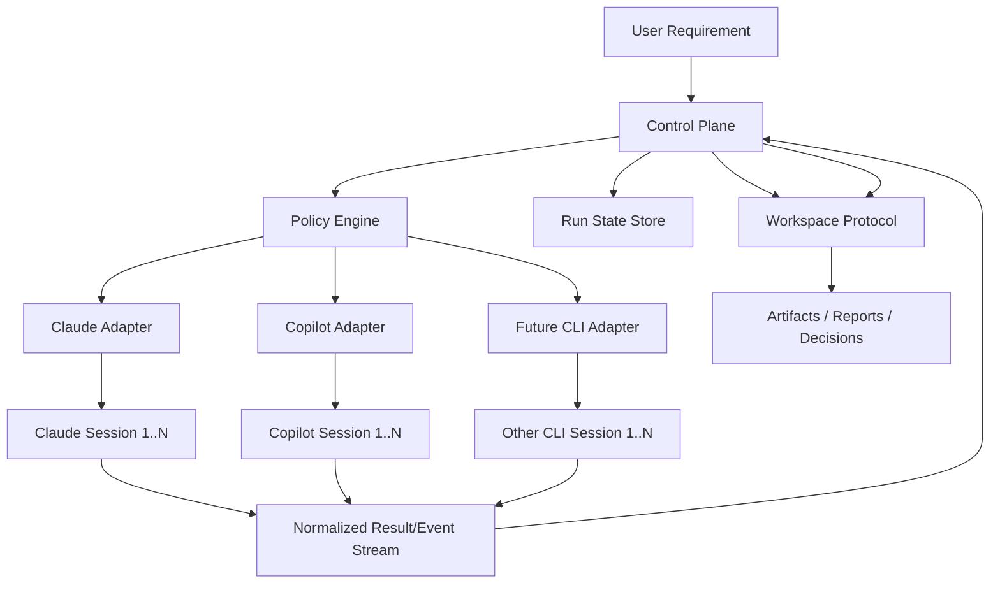

# AutoTeam Multi-CLI Control Plane Design

**Date:** 2026-03-24
**Status:** Proposed
**Audience:** Future maintainers and contributors

---

## 1. Context

AutoTeam currently runs entirely inside Claude Code. Its strengths are clear boundaries, file-mediated coordination, bounded loops, and a prompt-driven delivery pipeline. That architecture works well when every role is executed by Claude-native subagents inside one runtime.

The new goal is different: evolve AutoTeam into a framework that can coordinate **multiple CLI agents**, including:

- multiple `copilot` CLI sessions
- multiple `claude` CLI sessions
- mixed `copilot` + `claude` runs in the same pipeline

The problem is not role decomposition. AutoTeam already has that. The problem is that its current orchestrator assumes one host runtime, one tool environment, and one agent family. Multi-CLI coordination requires a separate control plane that can manage process lifecycle, session state, output normalization, retry policy, and safety boundaries across heterogeneous CLIs.

**Design goal:** preserve AutoTeam's protocol discipline while replacing the Claude-only orchestration model with a vendor-neutral, process-aware runtime.

---

## 2. Design Goals and Non-Goals

### Goals

1. Preserve the existing AutoTeam strengths:
   - file ownership
   - bounded loops
   - explicit escalation
   - QA aggregation
2. Support multiple concurrent or staged CLI workers from different vendors.
3. Normalize unstructured CLI output into a common event/result contract.
4. Prevent runaway cross-agent loops with explicit stop conditions.
5. Enable incremental migration from the current Claude-only implementation.

### Non-Goals

1. Replace every current prompt file in the first iteration.
2. Build a fully autonomous production-grade platform in the first iteration.
3. Guarantee identical behavior across all CLI vendors.
4. Solve vendor-specific auth, quota, or billing management beyond basic integration boundaries.

---

## 3. Architecture Overview

The current Claude-internal orchestration should be replaced by an **external control plane**. AutoTeam becomes a control framework with role templates, workspace contracts, and policy rules, while actual agent execution is delegated to CLI adapters.



### Core idea

- **Control Plane** decides what role should run next and on which CLI instance.
- **Adapters** translate between vendor-specific CLI interaction and AutoTeam's internal contract.
- **Workspace Protocol** remains the auditable artifact boundary.
- **State Store** tracks turns, retries, costs, loop counts, and final outcomes independently of any single CLI process.

This is the key inversion: the runtime no longer belongs to Claude Code. Claude CLI becomes one execution backend among many.

---

## 4. Major Components

### 4.1 Control Plane

The control plane is the new orchestration core. It owns:

- run creation
- role dispatch
- adapter selection
- loop tracking
- failure handling
- completion and halt decisions

It should be the only component allowed to transition a run from one phase to another.

### 4.2 Adapter Layer

Each CLI vendor gets a dedicated adapter:

- `claude_adapter`
- `copilot_adapter`
- future adapters such as `gemini_adapter` or internal wrappers

Each adapter is responsible for:

- starting or resuming CLI sessions
- sending prompts or task payloads
- collecting stdout/stderr or structured responses
- detecting completion, timeout, or failure
- converting raw output into the shared result contract

Adapters must not own orchestration policy. They are execution bridges, not decision-makers.

### 4.3 Policy Engine

The policy engine decides:

- which role runs next
- which vendor should handle that role
- whether a result is sufficient to continue
- when to retry, escalate, or stop

This engine should begin as a deterministic ruleset, not another LLM layer. That keeps behavior auditable and reduces cost and loop risk.

### 4.4 State Store

The state store records:

- run metadata
- worker assignments
- step attempts
- normalized results
- accumulated warnings/errors
- loop counters
- final disposition

This state must exist outside transient CLI process memory so runs can be inspected or resumed.

### 4.5 Workspace Protocol

`.openclaw/workspace/` remains valuable, but its meaning changes:

- before: agent-to-agent coordination inside one Claude-native runtime
- after: artifact and decision boundary owned by the control plane

Workers may still read and write files, but ownership and validation should now be enforced by the control plane rather than assumed by prompt instructions alone.

---

## 5. Execution Model

### 5.1 Run Lifecycle

Each request creates a run with explicit state transitions:

```text
READY
  -> DISPATCHING
  -> RUNNING
  -> COLLECTING
  -> EVALUATING
  -> RETRYING | ESCALATING | DONE | BLOCKED | FAILED
```

### 5.2 Worker Model

A worker is the combination of:

- role identity, such as `architecture` or `qa-security`
- vendor type, such as `claude` or `copilot`
- session identity, such as `claude-arch-1`

This distinction matters because one role may be mapped to different vendors in different runs, and multiple workers of the same type may be active simultaneously.

### 5.3 Dispatch Strategy

The control plane should support:

- **serial dispatch** for dependency-bound stages
- **parallel dispatch** for independent reviewers or module builders
- **competitive dispatch** where multiple workers attempt the same task and the policy engine selects the best result
- **review dispatch** where one vendor critiques another vendor's output

The first iteration only needs serial and review dispatch. Competitive orchestration can be introduced later.

---

## 6. Shared Contracts

Multi-CLI orchestration is not reliable unless all adapters produce the same internal structure. The following contracts are required.

### 6.1 Normalized Result

```yaml
worker_id: claude-arch-1
vendor: claude
role: architecture
run_id: run-20260324-001
status: succeeded
summary: "Proposed a control-plane architecture with adapter isolation."
raw_output_path: runs/run-20260324-001/raw/claude-arch-1.log
artifacts:
  - path: .openclaw/workspace/adr.md
    kind: design-doc
confidence: medium
next_action_hint:
  type: review
  target_role: architecture-review
  suggested_vendor: copilot
metrics:
  duration_ms: 18234
  tokens_in: null
  tokens_out: null
  cost_usd: null
error: null
```

### 6.2 Normalized Error

```yaml
status: failed
error:
  category: timeout | parse_error | permission_denied | tool_failure | vendor_error
  message: "Timed out waiting for session completion."
  retryable: true
```

### 6.3 Event Stream

The runtime should also support lightweight events:

- `worker_started`
- `output_received`
- `artifact_detected`
- `worker_completed`
- `worker_failed`
- `policy_decision_made`
- `run_halted`

This event stream is the basis for observability and later UI support.

---

## 7. Policy and Safety Rules

The existing bounded-loop philosophy should be retained and expanded.

### Required hard limits

1. Maximum total run rounds
2. Maximum retries per worker step
3. Maximum elapsed time per worker invocation
4. Maximum repeated near-duplicate outputs before halt
5. Maximum unresolved critical findings before forced human review

### Required stop states

- `DONE`: objective reached and validated
- `BLOCKED`: progress stopped by missing credentials, permissions, or environment requirements
- `FAILED`: retry budget exhausted or irrecoverable runtime failure
- `NEED_HUMAN`: ambiguity, conflict, or risk exceeds policy limits

### Loop prevention

Cross-vendor review can easily degenerate into repetitive disagreement. The control plane must detect:

- unchanged summary over multiple rounds
- unchanged artifact hashes
- repeated objections without net new evidence
- vendor ping-pong beyond configured limits

When detected, the run should escalate instead of continuing.

---

## 8. Repository Restructure

The current repository should evolve incrementally.

```text
.
├── .claude/
│   └── skills/
│       └── autoteam.md
├── .openclaw/
│   ├── agents/                  # legacy role prompts, kept during migration
│   ├── workspace/               # shared artifact boundary
│   └── settings.json
├── runtime/
│   ├── control_plane.py
│   ├── run_state.py
│   ├── event_bus.py
│   ├── process_manager.py
│   └── workspace_guard.py
├── adapters/
│   ├── base.py
│   ├── claude_adapter.py
│   └── copilot_adapter.py
├── contracts/
│   ├── result_schema.py
│   ├── event_schema.py
│   └── run_schema.py
├── policies/
│   ├── next_step_policy.py
│   ├── retry_policy.py
│   └── stop_conditions.py
├── runs/                        # local run artifacts, logs, transcripts
└── docs/
    └── superpowers/specs/
```

### Migration principle

Do not delete `.openclaw/agents/` in the first phase. Keep them as reference role templates while the external runtime is introduced. This reduces migration risk and preserves current behavior as a baseline.

---

## 9. Mapping Existing AutoTeam Roles to Multi-CLI Workers

The current roles remain useful, but their execution binding becomes dynamic.

| Role | Current Binding | Proposed Binding |
|---|---|---|
| Orchestration | Claude-only main session | External control plane |
| Product Planner | Claude subagent | Claude or Copilot worker |
| Architecture | Claude subagent | Claude or Copilot worker |
| Implementation | Claude subagent | Claude or Copilot worker |
| QA Security | Claude subagent | Claude or Copilot worker |
| QA Quality | Claude subagent | Claude or Copilot worker |
| QA Test | Claude subagent | Claude or Copilot worker |
| Documentation | Claude subagent | Claude or Copilot worker |

### Recommended initial binding

- Keep architecture-heavy roles on Claude first.
- Introduce Copilot first as reviewer, QA, or documentation support.
- Only after adapter quality is proven should mixed-vendor implementation loops be enabled.

This sequencing reduces risk while still exercising the new control plane.

---

## 10. Incremental Rollout Plan

### Phase 1 — Claude-to-Claude Externalization

Build the external control plane, but use only Claude workers. This validates:

- process lifecycle management
- run state transitions
- artifact ownership enforcement
- normalized result contracts

### Phase 2 — Claude + Copilot Review Loop

Add `copilot_adapter` and use it for review-oriented stages:

- architecture critique
- QA validation
- documentation verification

This phase validates heterogeneous dispatch without handing core code generation to the least-proven adapter path.

### Phase 3 — Mixed Execution Roles

Allow Copilot to own selected implementation or planning roles while Claude handles arbitration and architecture.

### Phase 4 — Multi-Instance Pools

Support:

- multiple Claude workers
- multiple Copilot workers
- mixed pools with policy-based assignment

At this point AutoTeam becomes a true multi-CLI orchestration framework rather than a Claude-centric pipeline with extensions.

---

## 11. Risks and Open Questions

### 11.1 Copilot CLI Automation Stability

Claude CLI already exposes a clearer non-interactive path. Copilot CLI appears more interaction-centric. Adapter quality may depend on process control, prompt discipline, and output parsing rather than a stable structured API. This is the most important integration risk.

### 11.2 TTY and Session Control

Some CLIs behave differently under stdio vs TTY. The runtime may need session-specific handling for:

- interactive prompts
- permission confirmations
- resumed sessions
- partial output collection

### 11.3 Output Normalization

Vendor outputs may differ widely in formatting and reliability. The control plane must treat raw output as untrusted input and normalize conservatively.

### 11.4 Cost and Loop Amplification

Mixed-agent critique loops can create compounding cost without improving outcome quality. Strong loop termination policy is mandatory.

### 11.5 Security and Secrets

The runtime must not leak credentials into workspace artifacts, logs, or replay files. Raw transcript storage should be explicitly scoped and redactable.

---

## 12. First PoC Scope

The first proof of concept should be intentionally narrow.

### In scope

- one external control-plane process
- one `claude_adapter`
- one `copilot_adapter`
- serial dispatch
- review dispatch
- normalized result objects
- stop/retry policy

### Out of scope

- vendor-agnostic plugin marketplace
- fully parallel worker pools
- advanced scheduling heuristics
- autonomous self-modifying prompts
- production-grade distributed execution

### Success criteria

1. A run can dispatch one Claude worker and one Copilot worker in sequence.
2. Both workers produce normalized result records.
3. The control plane can decide to continue, retry, stop, or escalate.
4. The run halts safely when outputs become repetitive or ambiguous.

---

## 13. Key Design Decisions

### Decision 1 — Externalize orchestration

Move orchestration out of Claude Code and into a standalone runtime. This is the enabling change for heterogeneous CLI coordination.

### Decision 2 — Preserve workspace protocol

Keep `.openclaw/workspace/` as the auditable artifact boundary instead of replacing it with implicit in-memory state.

### Decision 3 — Start with deterministic policy

Use explicit rules, not an extra LLM, to choose retry/continue/escalate behavior in the first iteration.

### Decision 4 — Migrate incrementally

Validate the new runtime with Claude-only runs before introducing Copilot and before enabling mixed implementation ownership.

### Decision 5 — Treat adapters as untrusted boundaries

Each adapter must normalize output, classify errors, and surface uncertainty explicitly. No adapter should be allowed to silently imply success.

---

## 14. Recommended Next Step

The next implementation spec should define:

1. adapter interfaces
2. run state schema
3. policy decision table
4. workspace ownership enforcement rules
5. the minimum PoC path for `claude + copilot` review dispatch

This keeps the first engineering phase narrow while still proving that AutoTeam can evolve from a Claude-internal workflow into a real multi-CLI control system.
